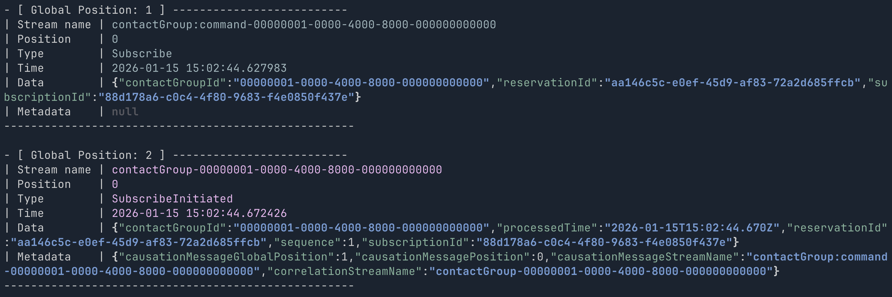

db-tail
=======

A small utility to tail the contents of a database table.

Currently it only supports [MessageDB](https://docs.eventide-project.org/user-guide/message-db/).

Installation
------------

```
cargo install db-tail
```

Usage
-----

```
Usage: db-tail [OPTIONS]

Options:
  -s, --stream-name-filter <STREAM_NAME_FILTER>  Stream name filter
  -t, --type-filter <TYPE_FILTER>                Type filter
  -r, --range <RANGE>                            Range of global positions to display
  -f, --follow                                   Keep monitoring table for new records
  -h, --help                                     Print help
  -V, --version                                  Print version
```

All options are optional.

The `--stream-name-filter` and `--type-filter` will filter the output to only
show records from the named stream and/or of the given type, both work by
checking it the target value contains the filter value, ie. a filter value of
"test" will match streams/types matching "AtestB". Multiple streams and types
can be named by providing multiple options.

The `--range` option takes a range of global positions to display, in the
format `START-END`.

Example output
--------------



